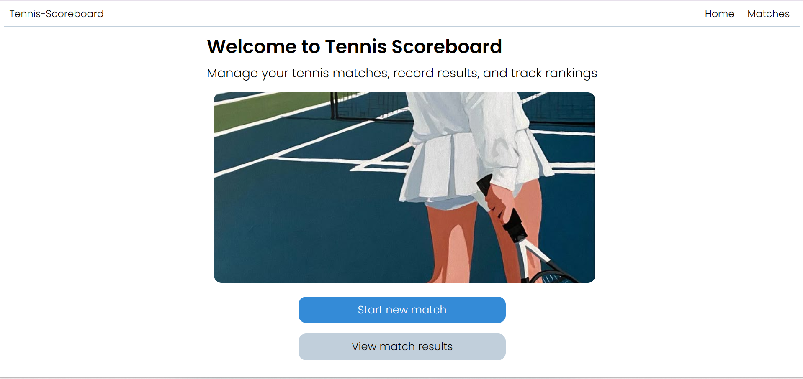
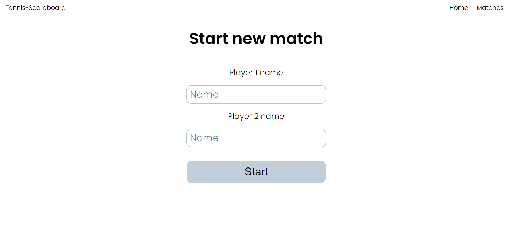
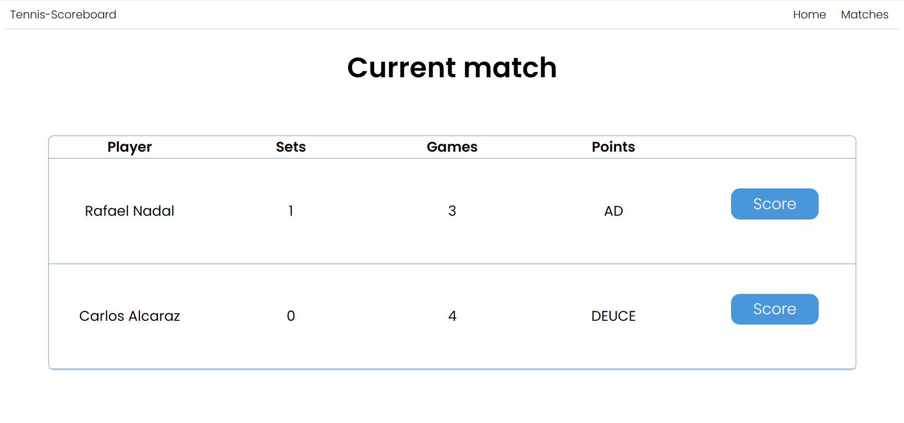
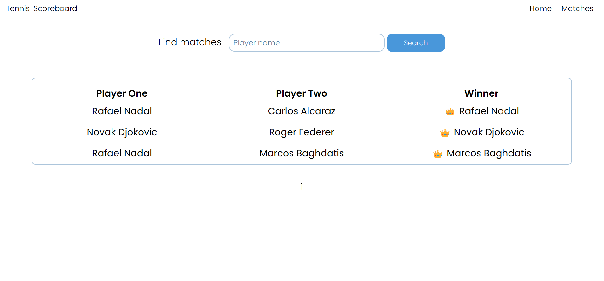

# 🎾 Проект “Табло теннисного матча”

Веб-приложение, реализующее табло счёта теннисного матча с полноценной логикой теннисного подсчёта.

## 🚀 Функциональность

- ✅ Создание нового матча  
- 🔍 Просмотр законченных матчей, поиск по именам игроков  
- 🔢 Подсчёт очков в текущем матче (включая **Deuce / Advantage**, **тай-брейк**)

---

## 🛠️ Технологии

| Компонент     | Технология                     |
|---------------|--------------------------------|
| Бэкенд        | Java EE (Servlet API)          |
| Сервер        | Apache Tomcat                  |
| База данных   | H2 (in-memory), Hibernate ORM  |
| Интерфейс     | HTML / CSS, JSP шаблоны        |
| Тестирование  | JUnit 5                        |

---

## 🖼️ Интерфейс приложения

### 🏁 Главный экран

### ➕ Создание нового матча

### 🎮 В процессе матча — отображение счета

### 📜 История завершённых матчей

---

## 📦 Запуск проекта

1. Собрать war-артефакт
2. Деплой в Tomcat
